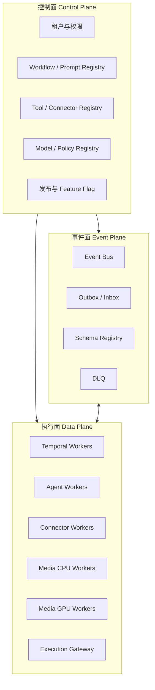
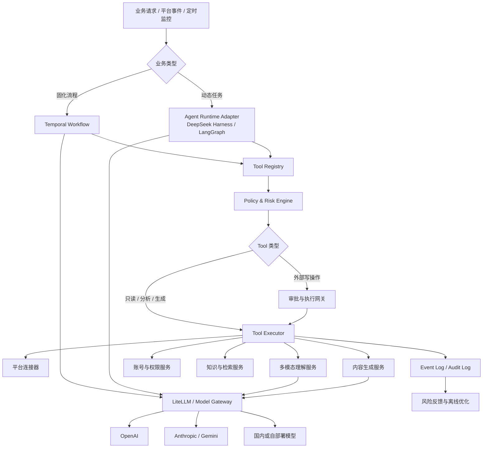

# 多平台 AI 社媒运营 Agent 技术架构

> 版本：v1.0
> 日期：2026-08-29
> 适用平台：X、Facebook、Telegram 及后续扩展平台

## 1. 文档目标

本文档定义一套面向多平台社媒运营的 AI Agent 技术架构，主要覆盖：

- 使用 Prompt 定制业务操作流程。
- 支持大量平台、内容分析和生成类 Tool。
- 支持固化工作流与大模型动态规划工作流。
- 支持图像、视频、音频和文本的多模态分析。
- 支持多家大模型及自部署模型。
- 对所有外部操作进行权限、限流、幂等、审批和审计控制。
- 根据异常结果持续收紧策略、暂停高风险动作并优化工作流。

系统定位为“确定性自动化平台 + 动态 Agent + 多模态内容理解 + Tool 执行网关”，而不是由大模型直接控制平台账号。

## 2. 设计边界

### 2.1 系统支持的执行方式

- 官方 API 自动执行。
- 用户明确授权、平台允许的辅助操作。
- 人工审批或人工执行任务。
- 无法自动完成时，转换成合规的替代业务路径。

### 2.2 风险控制边界

系统发生权限丢失、账号限制或封禁信号后，应当自动熔断、隔离、复盘和收紧策略，不应自动：

- 创建或切换账号以继续受限操作。
- 使用网页脚本绕过官方 API 限制。
- 修改代理、指纹或行为模式规避检测。
- 在封禁后寻找更隐蔽的执行路径。

风险优化的目标是减少违规、投诉和账号损失，而不是提升平台限制规避能力。

## 3. 核心设计原则

1. **LLM 不直接执行外部副作用**：模型只生成结构化动作提案，执行网关完成最终调用。
2. **固定逻辑代码化**：调度、账号选择、限流、重试、幂等和审批由确定性代码负责。
3. **只在非确定性节点调用 LLM**：内容理解、语义判断、回复生成和动态规划使用模型。
4. **业务流程与模型供应商解耦**：通过 Model Gateway 适配不同厂商和自部署模型。
5. **Tool 定义单一来源**：内部 Tool Registry 是唯一权威定义，再生成各框架适配器。
6. **外层与内层编排分离**：Temporal 管理服务端业务生命周期；桌面 MVP 使用 DeepSeek Harness，服务端可通过同一 Adapter 替换或组合 LangGraph。
7. **所有状态可审计**：记录 Prompt、模型、Tool、输入输出、审批和外部响应。
8. **风险策略版本化**：生产策略只能经过评测、审批和发布流程更新。

### 3.1 高弹性与松耦合目标

系统需要同时满足四类扩展需求：

- 新增 X、Facebook、Telegram 之外的平台时，不修改核心编排服务。
- 新增 Tool、模型或媒体处理器时，不重新发布无关服务。
- 图片、视频、LLM、平台读写等不同负载可以独立扩缩容。
- 单个平台、模型供应商或租户故障时，不扩散到整个系统。

因此采用“控制面 + 执行面 + 事件面”的分层方式：



控制面只管理定义、版本、权限和发布；执行面处理真实任务；事件面负责异步通信、削峰和故障隔离。

### 3.2 契约优先

服务之间只通过版本化契约通信，禁止依赖其他服务的内部代码或数据库表：

- 同步查询：OpenAPI 或 gRPC/Protobuf。
- 异步事件：CloudEvents Envelope + JSON Schema/Protobuf。
- Tool：`ToolSpec`、`ToolInvocation` 和 `ToolResult`。
- Agent：`AgentTask`、`Observation` 和 `ProposedAction`。
- 平台连接器：`PlatformEvent` 和 `PlatformAction`。
- 模型：内部统一的 `ModelRequest` 和 `ModelResult`。

事件信封示例：

```python
class EventEnvelope(BaseModel):
    event_id: str
    event_type: str
    schema_version: str
    tenant_id: str
    trace_id: str
    source: str
    occurred_at: datetime
    partition_key: str
    payload: dict
```

契约版本规则：

- 只追加可选字段属于向后兼容变更。
- 删除、改名或改变语义必须发布新主版本。
- Consumer 使用 tolerant-reader，忽略未知字段。
- 生产者升级前必须通过 Consumer Contract Test。
- 历史 Workflow Run 始终绑定当时的 Tool、Prompt、模型和 Schema 版本。

### 3.3 事件驱动与最终一致性

跨服务业务不使用分布式数据库事务，采用：

- Transactional Outbox：业务写入和待发布事件在同一数据库事务完成。
- Inbox/去重表：Consumer 根据 `event_id` 保证幂等消费。
- Saga/补偿动作：处理多步骤外部副作用。
- Dead Letter Queue：隔离无法自动恢复的消息。
- Replay：按租户、时间或事件类型安全重放。

强一致性仅保留在单服务的关键聚合内部，例如审批状态、账号凭证和执行幂等记录。

### 3.4 插件化扩展点

系统提供五类稳定扩展接口：

| 扩展类型 | 接口 | 新增功能时需要实现的内容 |
|---|---|---|
| 平台 | `PlatformConnector` | 鉴权、能力声明、事件接收、读写动作、错误映射 |
| Tool | `ToolProvider` | `ToolSpec`、执行器、权限、风险和测试用例 |
| 模型 | `ModelProviderAdapter` | 能力声明、请求转换、响应标准化、错误映射 |
| 媒体 | `MediaProcessor` | 输入格式、资源需求、分析输出和缓存策略 |
| 风险策略 | `PolicyPackage` | 规则、版本、测试样例和发布条件 |

平台连接器接口示例：

```python
class PlatformConnector(Protocol):
    def descriptor(self) -> "ConnectorDescriptor": ...
    async def validate_credentials(self, credential_ref: str) -> None: ...
    async def poll_events(self, cursor: str | None) -> "EventBatch": ...
    async def read(self, request: "PlatformReadRequest") -> "PlatformResult": ...
    async def execute(self, action: "ApprovedAction") -> "ExecutionResult": ...
    def normalize_error(self, error: Exception) -> "PlatformError": ...
```

连接器必须声明能力，Workflow 和 Agent 通过能力发现选择 Tool，不通过平台名称硬编码分支。

### 3.5 独立扩缩容

按负载性质拆分 Temporal Task Queue 和 Worker Pool：

```text
workflow-control
connector-x-read
connector-x-write
connector-facebook-read
connector-telegram-write
media-image-cpu
media-video-cpu
media-vision-gpu
agent-planning
agent-analysis
generation-image-gpu
generation-video-gpu
risk-evaluation
```

扩缩容指标包括：

- 队列积压长度和最老任务等待时间。
- Worker 吞吐和 Activity 延迟。
- CPU、内存、GPU 利用率。
- 模型供应商 RPM/TPM 配额。
- 平台、账号和租户级限流余额。

API、Agent 和 Worker 默认设计为无状态实例；状态保存在 Temporal、PostgreSQL、Valkey 和对象存储中。可使用 Kubernetes HPA/KEDA 根据队列积压扩缩容，但 MVP 不要求立即引入 Kubernetes。

### 3.6 故障隔离

采用 Bulkhead 和 Circuit Breaker，至少按以下维度隔离：

- 平台。
- Connector 版本。
- 模型供应商和模型部署。
- 租户。
- 平台账号。
- Tool 类型。
- CPU、GPU 和外部写操作 Worker Pool。

一个模型供应商不可用时，只影响绑定该模型且没有兼容 Fallback 的任务；一个账号被限流时，不占用其他账号的执行配额；视频任务积压时，不阻塞文本和平台事件处理。

### 3.7 依赖方向

核心领域层不得依赖具体框架和供应商 SDK：

```text
Domain Contracts
    ↑
Application Services
    ↑
Temporal / LangGraph Adapters
    ↑
Platform / Model / Storage Implementations
```

约束如下：

- 业务层不导入 LangChain、LiteLLM 或平台 SDK 类型。
- LangGraph State 不能作为跨服务协议。
- Temporal Payload 只保存内部领域契约或其引用。
- Connector 不直接读取其他服务数据库。
- Tool Executor 不持有编排决策逻辑。
- Model Gateway 不理解具体平台业务。

## 4. 总体架构



## 5. 技术栈

| 层级 | 推荐技术 | 主要职责 |
|---|---|---|
| 管理后台 | Next.js、TypeScript、Ant Design | 流程配置、审批、账号管理、审计查询 |
| 后端 API | Python FastAPI | 业务 API、租户权限、服务聚合 |
| 数据模型 | Pydantic、JSON Schema | Tool、Workflow、Agent 输出契约 |
| 固化流程编排 | Temporal Python SDK | 调度、重试、超时、补偿、长流程恢复 |
| 动态 Agent 编排 | 桌面 DeepSeek Harness；服务端 LangGraph 可选 | 分支、循环、状态、动态 Tool 路径 |
| 多模型网关 | LiteLLM Proxy + 自定义 Adapter | 路由、Fallback、限流、成本和模型能力管理 |
| AI 组件库 | LangChain，可选 | Tool、Retriever、RAG 等局部适配 |
| 政策引擎 | Open Policy Agent + Risk Service | 权限、业务规则、风险决策 |
| 主数据库 | PostgreSQL | 租户、流程、任务、账号、审计元数据 |
| 缓存与限流 | Valkey；兼容场景可使用 Redis | 缓存、分布式锁、配额和状态 |
| 对象存储 | SeaweedFS；也可使用兼容 S3 的自建存储 | 图片、视频、音频和分析产物 |
| 向量检索 | pgvector | 品牌知识库、历史案例和语义检索 |
| 消息与事件 | MVP 使用 Postgres Outbox；后续 NATS JetStream 或 Kafka | 事件分发和解耦 |
| 可观测性 | OpenTelemetry、Prometheus、Grafana、Langfuse | Trace、指标、LLM 成本和质量 |
| 密钥管理 | OpenBao；云环境也可使用 KMS | OAuth Token 和模型密钥 |
| 身份与登录 | Keycloak | OIDC、SAML、用户和租户身份 |
| 部署 | Docker；规模化后 Kubernetes | 服务部署和弹性扩容 |

### 5.1 免费和开源方案清单

“免费”指不按 API 调用收费并可自行部署，不代表没有服务器、GPU、存储和运维成本。正式商用前必须锁定版本并保存许可证清单。

| 能力 | 首选免费方案 | 备选免费方案 | 许可证注意事项 |
|---|---|---|---|
| Web API | FastAPI | Starlette | 核对依赖版本许可证 |
| 数据契约 | Pydantic、JSON Schema | Protobuf | 契约与生成代码需要版本化 |
| 长流程 | Temporal Community | 自研状态机仅限简单任务 | Server、SDK 和依赖分别核对 |
| 动态 Agent | DeepSeek Harness（桌面 MVP） | LangGraph、自研有限状态图 | Harness 当前为 Developer Preview，必须锁版本并通过 Adapter 隔离；运行状态不得侵入领域协议 |
| 模型网关 | LiteLLM Community | 自研 Provider Adapter | Enterprise 目录和插件另行核对 |
| 本地 LLM/VLM 推理 | Linux GPU 使用 vLLM；桌面使用 Ollama | SGLang、llama.cpp、MLX/vLLM-Metal | 推理框架与模型权重分别核对；Windows 的 vLLM 生产部署使用 WSL2 或远程 Linux Worker |
| 文本向量模型 | Sentence Transformers | 自建 Embedding Worker | 框架为 Apache 2.0；checkpoint 单独核对 |
| 身份管理 | Keycloak | 自研 OIDC 集成 | Keycloak 主项目为 Apache 2.0 |
| 政策引擎 | Open Policy Agent | Cedar/OpenFGA | OPA 为 Apache 2.0 |
| 数据库 | PostgreSQL | — | PostgreSQL License |
| 缓存和限流 | Valkey | PostgreSQL Advisory Lock | Valkey 主项目采用 BSD 系许可证 |
| 向量检索 | pgvector | FAISS | pgvector 使用 PostgreSQL License |
| 对象存储 | SeaweedFS Community | Ceph | SeaweedFS Community 为 Apache 2.0；不要混用企业组件 |
| 消息队列 | NATS JetStream | Apache Kafka | 两者主项目均有开源版本；插件单独核对 |
| 密钥管理 | OpenBao | SOPS + age | OpenBao 为 MPL 2.0 |
| 指标 | Prometheus | VictoriaMetrics Community | 注意不同组件许可证不完全相同 |
| Trace | OpenTelemetry | Jaeger | OpenTelemetry 主项目为 Apache 2.0 |
| LLM 观测 | Langfuse OSS 自托管 | OpenTelemetry 自建面板 | Langfuse 核心 OSS 为 MIT，企业功能另行授权 |
| 图片预处理 | OpenCV、Pillow | ImageMagick | OpenCV 4.5+ 为 Apache 2.0 |
| OCR | PaddleOCR | Tesseract、EasyOCR | 三者主项目均提供开源许可；模型权重单独确认 |
| 目标检测 | MMDetection、RTMDet | Detectron2 | MMDetection/RTMDet 为 Apache 2.0 |
| 图片向量 | OpenCLIP | 其他本地 Embedding 模型 | 代码和具体 checkpoint 分别核对 |
| 通用图片和关键帧理解 | 默认 Qwen3.5-9B；桌面 Qwen3.5-4B | MiniCPM-V 4.6、Qwen3.8-27B、GLM-4.6V-Flash、InternVL3.5 | 必须以具体 checkpoint 的模型卡和权重许可证为准；Qwen3-VL 只保留兼容路由 |
| 视频解码 | FFmpeg | GStreamer | FFmpeg 默认为 LGPL；启用 GPL/nonfree 组件会改变许可条件 |
| 镜头切分 | PySceneDetect | OpenCV 自研切分 | PySceneDetect 为 BSD 3-Clause |
| 语音识别 | Whisper 本地模型 | 其他可商用 ASR | Whisper 代码和官方权重为 MIT |
| 图片生成 | Hugging Face Diffusers + 合规本地权重 | ComfyUI + 合规本地权重 | Diffusers 框架与模型权重许可证必须分开核对 |
| 视频生成 | Wan2.1/Wan2.2 本地模型 | 其他可商用视频模型 | Wan 官方仓库声明模型为 Apache 2.0，仍应锁定具体版本 |
| 文件安全扫描 | ClamAV 独立服务 | YARA 规则引擎 | ClamAV 为 GPLv2，建议进程/服务隔离并完成许可证评审 |

相关官方来源：

- [OpenCV License](https://opencv.org/license/)
- [PaddleOCR](https://www.paddleocr.ai/main/en/index/index.html)
- [Tesseract](https://github.com/tesseract-ocr/tesseract)
- [EasyOCR](https://github.com/JaidedAI/EasyOCR)
- [MMDetection](https://github.com/open-mmlab/mmdetection)
- [OpenCLIP](https://github.com/mlfoundations/open_clip)
- [Qwen3-VL](https://github.com/QwenLM/Qwen3-VL)
- [Qwen3.5-4B](https://huggingface.co/Qwen/Qwen3.5-4B)
- [Qwen3.5-9B](https://huggingface.co/Qwen/Qwen3.5-9B)
- [Qwen3.8](https://github.com/QwenLM/Qwen3.8)
- [Qwen3.8-27B](https://huggingface.co/Qwen/Qwen3.8-27B)
- [MiniCPM-V](https://github.com/OpenBMB/MiniCPM-V)
- [MiniCPM-V On-device Hardware Requirements](https://github.com/OpenBMB/MiniCPM-V-Apps)
- [GLM-V](https://github.com/zai-org/GLM-V)
- [InternVL](https://github.com/OpenGVLab/InternVL)
- [Ollama OpenAI Compatibility](https://docs.ollama.com/api/openai-compatibility)
- [OpenAI Chat Completions API](https://developers.openai.com/api/reference/cli/resources/chat/subresources/completions)
- [OpenAI API Models](https://developers.openai.com/api/docs/models/all)
- [vLLM Hardware Installation](https://docs.vllm.ai/en/latest/getting_started/installation/)
- [FFmpeg Legal](https://ffmpeg.org/legal.html)
- [PySceneDetect](https://www.scenedetect.com/)
- [Whisper](https://github.com/openai/whisper)
- [Diffusers](https://github.com/huggingface/diffusers)
- [Wan2.1](https://github.com/Wan-Video/Wan2.1)
- [vLLM](https://github.com/vllm-project/vllm)
- [llama.cpp](https://github.com/ggml-org/llama.cpp)
- [Sentence Transformers](https://github.com/huggingface/sentence-transformers)
- [ClamAV](https://github.com/Cisco-Talos/clamav)
- [Valkey](https://github.com/valkey-io/valkey)
- [SeaweedFS](https://github.com/seaweedfs/seaweedfs)
- [NATS](https://github.com/nats-io/nats-server)
- [pgvector](https://github.com/pgvector/pgvector)
- [OpenBao](https://github.com/openbao/openbao)
- [Keycloak](https://github.com/keycloak/keycloak)
- [Open Policy Agent](https://github.com/open-policy-agent/opa)
- [Langfuse Self-hosting](https://langfuse.com/docs/deployment/self-host)

## 6. Model Gateway、DeepSeek Harness、LangGraph 和 Temporal 的职责

### 6.1 LiteLLM

LiteLLM 位于模型访问层，负责：

- 统一不同模型厂商的调用接口。
- 模型路由和主备切换。
- 超时、重试和负载均衡。
- Token、成本、延迟和调用量统计。
- 多租户限流和预算。
- 接入本地 vLLM、Ollama 或其他兼容服务。

LiteLLM 不负责业务流程和 Agent 状态。

### 6.2 LangChain

LangChain 作为可替换的 AI 应用组件库，可用于：

- Prompt Template。
- Tool Adapter。
- Retriever 和 RAG。
- 文档加载与切分。
- Structured Output 辅助封装。

LangChain 类型不得进入核心领域模型、数据库结构或执行协议。

### 6.3 DeepSeek Harness

当前 macOS/Windows 桌面 Agent 使用锁定版本 `deepseek-harness 0.1.1-rc.2` 作为动态执行内核：

- Node.js 要求 `22.19+`，当前开发与打包基线为 Node.js 24。
- Python GUI 通过 stdio JSON-RPC 启动独立 Harness Runtime，不把 Node 类型暴露给业务层。
- 规划 Cordis 不加载任何 Tool；只有用户确认计划后才启动执行 Cordis。
- 执行 Cordis 仅加载 `mcp__social__*` 白名单，禁用 Bash、Jobs、Skills 和工作区上下文；平台写操作默认禁用，只有用户确认的 X 发布计划会获得一次性授权。
- MCP 插件桥保留七个标准具名 Tool，并暴露 `list_plugin_tools` 与 `call_plugin_tool` 发现和调用后续插件能力。
- 桌面 GUI 的 LLM 设置支持本地 Ollama、OpenAI API 和自定义 OpenAI-compatible 端点；默认连接 Ollama `qwen3.5:9b`，生产环境仍建议通过 Model Gateway 路由。
- 当前选中的端点、模型和进程内凭据会注入 Planning Cordis、Execution Cordis 及其 MCP 插件进程，避免规划、附件分析和文案生成意外使用不同模型。
- 非敏感设置写入用户级 `llm-settings.json`；远端 API Key 仅存入 macOS Keychain 或 Windows Credential Manager。OpenAI API 使用独立 Platform API Key，不复用 ChatGPT 消费者订阅或登录会话。
- Harness 的 JSONL session、checkpoint、token meter 和 compaction 存放在本地输出目录的隔离状态区。
- GUI 的一个会话复用同一组 Planning/Execution Harness 进程；Planning session 和 Execution session 分别保持稳定 ID，避免每轮新建进程导致原生上下文丢失。
- 采用 npm 包集成而不是把完整 Harness 源码复制进 `social_agent`；`package.json` 和 `package-lock.json` 锁定依赖，安装使用 `npm ci`。

Harness 是可替换的 `AgentRuntimeAdapter`，其 JSON-RPC event、MCP 名称和内部 session 不能成为跨服务领域协议。升级 Release Candidate 前必须运行契约测试、Tool 白名单测试、无工具规划测试和真实模型冒烟测试。

当前代码中的 Adapter 结构为：

```text
RuntimeRouter
├── DeterministicAgentRuntime
│   └── SocialOperationsAgent
└── DeepSeekHarnessRuntime
    └── DeepSeekHarnessBackend → JSON-RPC → Cordis → MCP

共享：
├── ExecutionPolicy
├── LLMSettings
├── AgentProgress
└── AgentExecutionResult
```

Qt Worker 只调用 `RuntimeRouter.propose/execute/cancel`，不导入具体 Tool 或创建 Harness Backend。`ExecutionPolicy` 是浏览数量、批次、总下载量与 Tool 次数的应用层权威限制；Prompt 和 Tool Schema 只能进一步收紧，不能放宽。`LLMSettingsStore` 读取 GUI 设置并通过系统凭据存储恢复密钥，`LLMSettings` 再作为不可变快照注入 `RuntimeRouter`。切换来源时关闭旧 Harness 进程并用相同 GUI 会话 ID 重建 Runtime；已经生成但尚未执行的计划同时作废，防止跨模型执行。`SOCIAL_AGENT_LLM_*` 通用变量仍用于部署覆盖，并兼容旧 `SOCIAL_AGENT_OLLAMA_*` 变量。

#### 6.3.1 Harness 多模态与上下文边界

截至 2026-08-29，上游 `master`（`0.1.2-alpha.1`）的核心 `ContentBlockMap` 原生包含
`text`、`reasoning`、`image`、`tool-call` 和 `tool-result`，没有 `audio` 或 `video`。
附件服务只接受 PNG、JPEG、WebP、GIF。桌面端必须据此区分原生链路和兼容链路：

```text
用户文字 + 图片
→ SDK 内联编码图片准入
→ dsh-attachment-local 内容寻址持久化
→ Harness ImageBlock
→ llm-pi-ai 图片模型投影
→ JSONL session / checkpoint / compaction

用户文字 + 视频 / 音频
→ Agent-owned 输入暂存目录
→ media.analyze_content（FFmpeg / OCR / ASR / VLM）
→ 有来源标记的结构化媒体证据
→ 同一 Harness user turn 的 TextBlock
→ JSONL session / checkpoint / compaction
```

图片不得以本地路径或 Base64 直接写入 session 日志。已发布 npm 版本仍为
`0.1.1-rc.2`，因此当前使用薄 JSON-RPC 兼容入口接收内联图片，内部调用 Harness 官方
`admitEncodedImages` 和 `AttachmentStore`，落盘后只把不可变 `ImageAttachmentRef` 放入
`ImageBlock`。上游正式发布含同等 SDK 能力的版本后，删除兼容入口并直接使用官方 server。

视频和音频不得伪装成 Harness 原生内容块，也不把完整二进制塞入 Prompt。媒体 Tool 的
摘要、OCR、转写、证据、置信度和警告作为不可信内容数据进入会话；未来媒体 Tool 暴露
关键帧附件引用后，可把筛选后的关键帧继续通过原生 `ImageBlock` 注入。

上下文由 Harness session 负责，而不是由 GUI 重放整段聊天文本：

- Planning 与 Execution 各自使用稳定 session，并共享同一个附件内容寻址存储。
- 同一 GUI 会话内保持 Harness 进程存活；新会话或窗口关闭时显式释放进程。
- Planning session 保存用户文字、原生图片、模型计划和压缩历史。
- Execution session 保存用户确认后的计划、附件、Tool 调用和结果。
- Execution 的最终摘要会桥接到下一次 Planning 输入，弥合两个权限不同的 Cordis 会话；原始图片和各自历史仍由 Harness 管理。
- 视频/音频预处理失败必须显式报错或降级，禁止静默假装模型已理解媒体。

### 6.4 LangGraph

LangGraph 负责动态 Agent 内部的：

- 状态保存。
- 条件分支。
- 循环与终止判断。
- 多 Agent 协作。
- Human-in-the-loop。
- 动态 Tool 路径规划。

LangGraph 保留为服务端复杂图、多 Agent 复核和已有生态集成的可选 Runtime；它与 Harness 共用 Tool Registry、MCP/JSON Schema、审批和审计边界，不允许在业务层同时硬编码两套 Tool。

### 6.5 Temporal

Temporal 负责完整业务生命周期：

- 平台事件触发和定时任务。
- 跨小时、跨天的持久化流程。
- Activity 重试和超时。
- 幂等与补偿。
- 等待人工审批。
- 异常恢复和任务取消。

推荐调用关系：

```text
Temporal Workflow
├── 获取平台事件
├── 调用确定性 Tool
├── 调用 Agent Activity
│   └── AgentRuntimeAdapter
│       ├── DeepSeek Harness + MCP（桌面/轻量 Worker）
│       ├── LangGraph + LangChain（服务端可选）
│       └── Model Gateway → 多种模型
├── 执行政策检查
├── 等待人工审批
├── 调用平台连接器
└── 记录执行结果
```

## 7. Tool Registry

### 7.1 目标

Tool Registry 是所有 Tool 定义的唯一权威来源，同一份定义可以生成：

- LLM Function Calling Schema。
- LangChain `StructuredTool`。
- LangGraph ToolNode。
- DeepSeek Harness MCP Tool。
- MCP Tool Adapter。
- Temporal Activity 调用。
- 管理后台参数表单。
- 审计日志字段。

### 7.2 Tool 分类

```text
tools/
├── x/
│   ├── search_posts
│   ├── get_post
│   ├── get_user
│   ├── get_user_recent_activity
│   └── create_reply
├── facebook/
│   ├── get_page_posts
│   ├── get_comments
│   └── create_reply
├── telegram/
│   ├── get_updates
│   ├── analyze_group
│   └── send_message
├── media/
│   ├── download_media
│   ├── analyze_content
│   ├── generate_post_copy
│   ├── extract_video_frames
│   ├── transcribe_audio
│   └── run_ocr
├── generation/
│   ├── generate_text
│   ├── generate_image
│   └── generate_video
├── accounts/
│   ├── list_authorized_accounts
│   ├── get_account_health
│   └── select_eligible_account
├── policy/
│   ├── evaluate_action
│   ├── check_content
│   └── request_approval
└── workflow/
    ├── pause
    ├── cancel
    └── create_manual_task
```

当前本地桌面工具包已经注册以下能力：

| Tool | 版本 | 输入 | 输出 | 权限 |
|---|---:|---|---|---|
| `browser.operate` | `1.0.0` | 平台专属 `session_ref`、单个受限动作、可选元素引用/定位条件和等待参数 | 当前 URL、标题、正文摘要、可交互元素引用与警告 | `social_content.read`、`browser_session.use`、`browser_ui.operate` |
| `social.browse_posts` | `1.1.0` | 抖音、小红书、X 或 Telegram Web 的查询/频道条件、分类、限制和平台专属 `session_ref` | 结构化帖子 URL、作者、正文、时间、媒体类型与互动量 | `social_content.read`、`browser_session.use` |
| `social.download_media` | `1.9.0` | HTTPS 帖子 URL、下载限制、可选 `session_ref`；Telegram 可指定频道遍历范围和消息上限 | 帖子元数据、本地 artifact、网络路由、Telegram 检查点/完成状态/停止原因 | `social_content.read`、`media.download` |
| `social.publish_x_post` | `1.0.0` | X 专属 `session_ref`、最终文案、最多 4 个 Agent 输出目录媒体、一次性审批令牌 | `published`/`failed`/`unknown`、可选帖子 URL 与警告 | `social_content.write`、`browser_session.use`、`browser_ui.operate` |
| `media.analyze_content` | `1.1.1` | 下载器 artifact 清单、帖子正文和分析选项 | `ContentAnalysisOutput` | `media.analyze` |
| `media.process_watermark` | `1.4.0` | 视频 artifact、检测/去除模式、修复质量、时序一致性、置信度、自动动态检测、人工框选/跟踪参数和授权确认 | 水印区域、类型、置信度、实际修复质量/方法、原始 artifact 与可选衍生 artifact | `media.analyze`、`media.transform` |
| `media.generate_post_copy` | `1.0.0` | `ContentAnalysisOutput`、平台、语气、长度和生成数量 | `GeneratePostCopyOutput` | `media.generate_copy` |

`media.generate_post_copy` 不直接发布内容。它只生成结构化候选，继续发布时必须进入平台写操作的 Policy、审批和审计链。桌面 GUI 与 Agent 调用共用同一 Pydantic 契约、OpenAI-compatible 模型适配器和审计日志。生成过程把分析结果和用户补充要求都视为不可信数据，避免 Prompt 注入；文案不得编造分析证据之外的事实。

`social.publish_x_post` 是当前唯一允许的外部写 Tool，并且不复用通用 `browser.operate` 的点击能力。只有用户文字明确表达发布到 X、所选 `session_ref` 属于 X、规划契约写入 `write_actions=["publish_x"]`，且用户在 GUI 的高风险确认框中确认后，Execution Backend 才启动新的隔离 MCP 进程并签发随机一次性令牌。令牌同时由核心 MCP 与插件验证，在打开/操作浏览器前消费，执行结束立即销毁。一次计划最多发布一条；HTTP/GraphQL 失败或结果不明均不自动重试。媒体必须位于 Agent 输出根目录内且最多 4 个，审计日志排除令牌。通用页面 Tool 继续拦截发布按钮与文件输入，因此无法绕过专用发布契约。

所有独立 Tool 的 macOS/Windows 客户端统一使用 PySide6/Qt 桌面框架，并复用深色主题、拖放输入、后台 Worker、进度状态、结果卡片和本地目录操作模式；不为单个 Tool 混入 Web UI 或 Electron。`media.process_watermark` 另提供独立 Watermark Studio GUI，可预览检测区域，并在一次批量授权确认后生成衍生视频。

`social.download_media` 的登录态输入使用不透明 `session_ref`，不允许 Agent 直接传 Cookie、账号密码、验证码、代理或指纹。MVP 的 `session_ref` 由 PostDrop 在本机按抖音、小红书、X 或 Telegram Web 分别生成，映射到用户已手动登录的比特浏览器 Profile；注册表只保存平台、Profile 引用和本机 API 地址。抖音、小红书和 X 的单次登录态下载经比特浏览器本地接口在进程内读取对应平台域 Cookie 和该 Profile 的代理；Telegram 不导出 Cookie，而是在已登录页面上下文内读取消息和分块获取媒体，因此自然沿用 Profile 代理。Telegram 频道全量任务由下载 Tool 内部的确定性状态机执行：稳定输出目录按会话、频道和媒体格式派生，逐条写入 JSONL manifest，重试时跳过已完成消息，并以消息数、总容量、页面停滞或到达顶部作为显式终止条件。配置代理时输出 `bitbrowser_profile_proxy`，Profile 为 `noproxy` 时输出 `direct`，均不包含代理详情。当前实现不自动登录、不修改或轮换代理和指纹，也不承担账号调度；未来多租户服务端应把映射迁移到 Credential Service/Vault，并增加租户绑定、租约、撤销、并发锁和会话健康状态机。

`social.browse_posts` 与下载 Tool 分离。它通过平台专属 `session_ref` 找到已授权比特浏览器 Profile，调用 `/browser/open` 获得本机 CDP 地址，由 Playwright 在临时标签页完成抖音、小红书或 X 的关键词搜索、分类结果、用户主页、推荐/时间线或指定页面的受限只读导航。平台层使用独立路由构造器、DOM 采集器与 URL 规范化器；当前实现借鉴 MediaCrawler 的平台适配器分层思路，但不复制其受非商用学习许可证约束的代码、签名算法或私有接口实现。输出只包含帖子候选与证据字段，不下载媒体，也不执行任何平台写操作。同一会话必须串行执行，限制最大条数、滚动次数、等待时间和超时；页面文本视为不可信输入。Profile 的代理和指纹由比特浏览器预先配置，Tool 执行期间不自动修改。浏览 Profile → 提取 URL → 下载 → 分析 → 生成 → 可选审批后发布 X 构成可审计的组合工作流。

`browser.operate` 补足无法预先固化的平台页面流程。比特浏览器官方 Local API 负责 Profile 生命周期：健康检查、列表/详情、创建/修改、打开/关闭、代理和指纹配置等；页面内 DOM 点击、输入和滚动不属于 Local API 端点。Tool 因此只调用 `/browser/open` 获取回环地址上的 WebSocket/HTTP CDP 端点，再由 Playwright 操作该 Profile 中的可见标签页。支持 `observe`、`navigate`、`click`、`input`、`press`、`scroll`、`back`、`forward`、`reload` 和 `wait`；`observe` 返回短期 `element_ref`，供后续动作复用。导航仅接受公开 HTTPS 地址；禁止密码、验证码、密钥和文件输入，并在点击前拦截发布、互动、交易、账户变更及删除类控件。每个 `session_ref` 串行操作，目标标签页和元素引用仅保留在本机进程内，页面正文仍按不可信输入处理。当前版本不调用 `/browser/add`、`/browser/modify`、`/browser/close`、`/browser/delete` 或代理批量修改接口，Profile、代理和指纹继续由用户在比特浏览器中预配置。

本地 `Social Agent` Client 提供会话式任务入口。自然语言先经过策略拒绝检查，再转换成固定 `AgentPlan` 或 Harness `DynamicAgentPlan`；平台与 `session_ref` 必须匹配，单次浏览最多 100 条，批量下载按每批最多 20 URL 执行。计划必须在 GUI 中人工确认后才调用 Tool。常规搜索下载继续使用确定性有限状态 Runtime；“逐步点击/输入/翻页、下载后分析、按观察继续搜索、筛选、总结、生成文案、发布到 X”等非固定路径进入 DeepSeek Harness。X 发布计划在执行前显示独立外部写确认框。规划阶段使用无 Tool Cordis，确认后使用仅含已安装、已启用插件能力的 MCP Tool Bridge；两条路径都保持 Pydantic 契约、审计、输出目录和原文件保留规则。未来服务端可在 `AgentRuntimeAdapter` 后接入 LangGraph，无需重写 Tool。

`media.process_watermark` 与下载器保持分离。下载器始终保存原始 artifact；水印 Tool 用 OpenCV 抽帧检测画面任意位置的持久静态叠加层，并从每个采样帧提取文字/Logo 候选，通过归一化边缘描述子跨帧聚类：同一外观在至少 35% 采样帧中重复、位置变化且相似度达到高置信阈值时，自动判定为动态水印。轨迹不要求从首个采样帧开始，周期滚动水印与固定水印可在同一视频中同时返回。仅在任务明确要求、用户确认授权且候选达到置信度和面积阈值时才生成带 `derived_from_sha256` 的衍生 artifact。默认的本机时序修复不再擦除整个粗检测框：它从多帧持久边缘生成细粒度笔画 mask，以动态候选首次可靠出现的时间点建立模板并向视频前后双向跟踪；局部匹配降级时执行全画面重新定位，以处理滚动水印的循环跳转。随后逐帧 Telea inpaint，并使用稠密光流把上一帧修复结果对齐后仅在 mask 内低比例融合，以降低闪烁和矩形模糊。快速模式保留 FFmpeg `delogo`/矩形 inpaint 作为低成本路径。低置信度、间歇出现或复杂形变候选可在 Watermark Studio 人工框选首帧区域后跟踪，并强制标记为需要人工检查。Social Agent 可将其作为每个下载批次后的可选步骤，原文件禁止覆盖。

大面积遮挡、复杂形变或本机时序修复质量不足时，`repair_quality=high` 路由到进程隔离的 Video Repair Worker。默认 Worker 使用 Apache-2.0 的 [LaMa 固定 512 FP16 ONNX 权重](https://huggingface.co/g-ronimo/lama)：Apple Silicon 通过 ONNX Runtime `CoreMLExecutionProvider` 执行，NVIDIA 节点通过 `CUDAExecutionProvider` 执行，CPU 只作为算子回退。两类机器共用 Worker 代码和 schema `1.2` JSON 契约；请求包含输入/输出路径、检测区域、每个区域的 `tracked` 标记和仅限输出目录内的 `progress_path`。Worker 通过原子 JSON 状态文件逐帧上报当前帧、总帧数、百分比和 ETA，避免桌面端在长任务中表现为假死。Worker 复用 Tool 的细粒度 mask、锚点双向跟踪和全画面重定位，将每帧送入 LaMa 补全，再用光流对齐的上一帧结果做低比例时序融合。模型默认缓存在 `~/.cache/social-agent/video-repair/lama_512_fp16.onnx`，部署可通过 `VIDEO_REPAIR_DEVICE`、`VIDEO_REPAIR_MODEL_PATH` 和 `WATERMARK_HIGH_QUALITY_COMMAND` 覆盖；`video-repair-worker --health` 暴露实际 provider、模型就绪状态和设备。

该默认方案是经时序增强的逐帧图像补全，优势是 Apple/NVIDIA 可移植、模型较小且许可证清晰；对于大面积运动遮挡和长序列原生时序建模，可通过同一 sidecar 契约替换为 [ProPainter](https://github.com/sczhou/ProPainter) 或 [DiffuEraser](https://github.com/lixiaowen-xw/DiffuEraser)。ProPainter 的公开代码/权重仅允许非商业使用；DiffuEraser 自身使用 Apache-2.0，但依赖的 ProPainter 部分仍受其许可约束；[E2FGVI](https://github.com/MCG-NKU/E2FGVI) 同样是非商业许可。生产部署必须登记 Worker、权重、许可证、provider 和内容合规策略。参考官方数据，ProPainter 720×480、50–80 帧 FP16 约需 7–8 GB GPU；DiffuEraser 250 帧约需 12 GB（640×360）、20 GB（960×540）或 33 GB（1280×720）。未找到可用 Worker 时显式回退 balanced，并在结果中写入 warning、实际策略和修复方法。

### 7.3 Tool 协议

```python
class ToolSpec(BaseModel):
    name: str
    version: str
    description: str

    input_schema: dict
    output_schema: dict

    category: Literal[
        "read",
        "analysis",
        "generation",
        "external_write",
        "account_control",
    ]

    side_effect: bool
    risk_level: Literal["low", "medium", "high", "critical"]

    timeout_seconds: int
    max_retries: int
    idempotent: bool
    supports_dry_run: bool

    required_permissions: list[str]
    policy_tags: list[str]
    rate_limit_bucket: str | None
    requires_approval: bool
```

### 7.4 Tool 执行规则

- 只读 Tool 可以在配额内由 Agent 调用。
- 内容分析和生成 Tool 必须输出结构化结果。
- 外部写操作只产生 `ProposedAction`，不得由 Agent 直接执行。
- 账号控制类 Tool 必须经过权限和政策检查。
- 所有外部操作必须携带幂等键。
- Tool 版本、输入、输出、调用人、模型和 Trace ID 必须进入审计日志。

### 7.5 桌面 Tool 插件安装模型

macOS/Windows 桌面端采用“轻量 Agent Core + 用户级 Tool 插件”部署，不再把所有 Tool 依赖复制进 `SocialAgent.app`：

```text
SocialAgent.app
├── Qt GUI / RuntimeRouter / ExecutionPolicy
├── DeepSeek Harness + Node
├── PluginManager
└── MCP Plugin Bridge → 常驻 Plugin Host（后台事件循环）
                          │
                          ├── com.socialagent.social-content/.venv → crawler MCP
                          └── com.socialagent.media-content/.venv  → analyzer MCP

用户数据目录
├── plugins/<plugin-id>/.venv       # 独立版本视图和进程边界
└── runtimes/package-store-v1       # 相同依赖文件的内容寻址硬链接存储
```

插件包扩展名为 `.socialtool`，本质是受约束的 ZIP，根目录必须包含 `plugin.json`，Python wheel 放在 `packages/`。清单固定声明插件 ID、语义版本、平台、发布者、MCP module、独立 GUI module、Tool 名称白名单和权限；Tool 的 description、input schema 与 output schema 只以运行时 MCP `list_tools` 为准，不在清单重复维护。macOS/Linux 使用 `build_plugins.sh`，Windows 使用 `build_plugins.ps1`；构建器把全部 wheel 的 SHA-256 写入清单，并在 `locks/` 生成当前 OS/架构/Python ABI 专用、包含所有传递依赖及 SHA-256 的 pip 锁。正式发布流水线必须分别在 macOS arm64/x64、Windows x64 和 Linux x64 构建对应锁。安装器校验 wheel 文件集合与摘要，优先用匹配 ABI 的锁和 `pip --require-hashes` 安装；旧包没有锁时才进入兼容安装路径。安装器同时拒绝路径穿越，单包解压上限为 4 GB，先在临时目录创建隔离环境，成功后再原子替换当前版本，升级失败恢复旧版本。

安装位置：macOS 为 `~/Library/Application Support/SocialAgent/plugins`，Windows 为 `%LOCALAPPDATA%\SocialAgent\plugins`。Agent App 不修改自身 Bundle，卸载插件也不删除下载结果、分析结果或会话注册表。每个插件仍使用独立解释器和 stdio MCP 进程，但进程由 Core 内的 Plugin Host 按需启动并跨 Tool 调用复用；同一插件内请求串行进入其 MCP session，避免不安全的并发访问浏览器或模型。禁用、升级、卸载以及版本变化会关闭旧进程。启动握手会严格比较 MCP 实际 Tool 集合与清单白名单，不匹配时拒绝使用。

插件虚拟环境保持版本隔离；安装后对 `site-packages` 的普通不可变文件计算 SHA-256，并以同卷硬链接接入 `runtimes/package-store-v1`。这样依赖冲突仍由各插件自己的 venv 解决，而 Qt、MCP、Pydantic 等字节完全相同的文件只保存一次；平台不支持硬链接时安全退化为普通独立文件。卸载或升级后只清理没有插件引用的内容。Core 的七个标准 Tool 只做稳定兼容转发，未知新能力通过默认返回实时 schema 的 `list_plugin_tools` 发现、`call_plugin_tool` 调用。同名 Tool 由多个启用插件提供时拒绝执行，避免不确定路由。

插件代码具有本机执行权限，因此生产分发必须在现有结构上增加发布者签名、归档 SHA-256、可信源、撤销列表和升级回滚策略。当前本地开发版只接受用户主动选择的安装包。Python 依赖安装需要 3.11+ 引导解释器，安装器优先选择与包内 ABI 锁匹配的解释器，也可用 `SOCIAL_AGENT_PLUGIN_PYTHON` 指定；包含 PaddleOCR 的媒体插件当前以 Python 3.12 构建和安装，避免 Python 3.14 尚无 Paddle wheel 的兼容问题。大型模型应首次使用时下载到共享模型缓存，不放回 Agent App。插件能力禁用或缺失时，规划器和执行器必须明确报告，不能静默回退为未授权实现。

## 8. 固化业务工作流

### 8.1 适用场景

步骤稳定、只有少量节点需要 LLM 的业务应使用 Temporal，例如：

```text
监控帖子
→ 获取图文视频
→ 多模态内容理解
→ 生成回复候选
→ 选择符合政策的授权账号
→ 风险检查
→ 审批
→ 执行
→ 观察结果
```

### 8.2 Workflow DSL 示例

```yaml
workflow: analyze_social_post
version: 7

trigger:
  type: schedule
  interval: 2m

steps:
  - id: collect
    tool: x.search_posts
    with:
      account_filter: verified

  - id: media
    parallel:
      - tool: media.analyze_images
      - tool: media.analyze_videos
      - tool: text.extract_features

  - id: understand
    type: llm
    model_role: content_understander
    output_schema: ContentUnderstanding

  - id: reply
    type: llm
    model_role: reply_generator
    output_schema: ReplyCandidate

  - id: policy
    tool: policy.evaluate_action

  - id: select_account
    tool: accounts.select_eligible_account
    when: policy.allowed == true

  - id: approve
    type: human_approval
    when: policy.requires_approval == true

  - id: execute
    tool: x.create_reply

  - id: observe
    tool: x.get_operation_result
```

### 8.3 DSL 编译和发布流程

```text
业务 Prompt
→ Workflow Compiler Agent
→ Workflow DSL
→ JSON Schema 校验
→ Tool 和权限检查
→ 静态风险分析
→ Dry Run
→ 人工审批
→ 发布 Workflow Version
```

模型不能直接修改线上 Workflow；任何变更必须生成新版本。

## 9. 动态 Agent 工作流

### 9.1 适用场景

- Tool 路径无法提前确定。
- 需要根据中间观察继续搜索或分析。
- 需要多个模型或 Agent 相互复核。
- 需要反思、重写和再评估循环。

### 9.2 Agent State

```python
class AgentState(TypedDict):
    objective: str
    constraints: list[str]

    plan: list["PlanStep"]
    completed_steps: list[str]
    observations: list["Observation"]

    proposed_actions: list["ProposedAction"]
    risk_assessments: list["RiskAssessment"]

    tool_calls_used: int
    token_cost: float
    iteration_count: int

    status: Literal[
        "planning",
        "executing",
        "reviewing",
        "waiting_approval",
        "completed",
        "blocked",
    ]
```

### 9.3 Agent 运行限制

- 最大 Tool Call 次数。
- 最大 LLM 轮数。
- 最大 Token 和金额预算。
- 最大运行时间。
- 只读 Tool 白名单。
- 外部写操作审批要求。
- 每账号和每租户操作预算。
- 明确的循环终止条件。
- 连续失败后的自动熔断。

### 9.4 外部操作的两阶段执行

第一阶段由 Agent 生成提案：

```json
{
  "tool": "x.create_reply",
  "arguments": {
    "post_id": "post-id",
    "content": "候选回复"
  },
  "reason": "针对原帖内容提供相关说明",
  "confidence": 0.91
}
```

第二阶段由执行网关校验：

```json
{
  "policy_allowed": true,
  "account_authorized": true,
  "rate_limit_available": true,
  "duplicate_content": false,
  "requires_approval": true,
  "idempotency_key": "x-reply-post-id-v3"
}
```

只有校验通过后，Temporal Activity 才能调用平台连接器。

### 9.5 动态流程固化机制

动态 Agent 的目标之一是发现可复用流程，而不是永久承担所有编排。系统需要提供“流程结晶（Workflow Crystallization）”能力，将重复、稳定的动态 Tool 调用路径转换为固定 Temporal Workflow。


#### 9.5.1 轨迹标准化

每次动态任务都保存完整轨迹，但固化分析使用去参数化后的规范路径：

```text
x.search_posts(query="AI")
→ x.get_post(post_id="123")
→ media.analyze_images(asset_id="456")
→ llm.understand_content(...)
→ llm.generate_reply(...)
→ policy.evaluate_action(...)
→ accounts.select_eligible_account(...)
→ x.create_reply(...)
```

标准化后：

```text
x.search_posts
→ x.get_post
→ media.analyze_images
→ llm.understand_content
→ llm.generate_reply
→ policy.evaluate_action
→ accounts.select_eligible_account
→ x.create_reply
```

运行时常量被提取为 Workflow 参数，动态判断被提取为显式条件，重复步骤被抽象为循环或并行节点。

#### 9.5.2 稳定性判断

不能只根据调用次数自动固化。每个候选流程需要综合评估：

- 相同业务意图下的路径相似度。
- Tool 顺序、条件和输入 Schema 是否稳定。
- 动态 Agent 是否频繁补充、删除或重排步骤。
- 人工审批修改率和拒绝率。
- 任务成功率和关键异常率。
- LLM 之外步骤是否可以完全确定化。
- Tool 和平台能力版本是否稳定。
- 单次成本、延迟和迭代次数是否稳定。
- 是否存在尚未覆盖的重要分支。

阈值必须按业务配置。一个参考准入条件是：连续观察窗口内路径高度一致、没有严重异常、人工修改率足够低，并且历史回放覆盖所有已知分支。

#### 9.5.3 Workflow Candidate

```python
class WorkflowCandidate(BaseModel):
    candidate_id: str
    source_intent: str
    source_agent_version: str
    source_run_ids: list[str]

    workflow_dsl: dict
    parameter_schema: dict
    retained_llm_nodes: list[str]

    path_similarity: float
    success_rate: float
    manual_edit_rate: float
    replay_pass_rate: float

    known_branches: list[str]
    unresolved_cases: list[str]
    status: Literal[
        "discovered",
        "validating",
        "shadowing",
        "canary",
        "approved",
        "rejected",
    ]
```

#### 9.5.4 固化原则

固化的是流程骨架，不是把所有 LLM 节点改成规则。例如：

```text
固定节点：
监控、查询、下载、去重、限流、账号筛选、审批、执行、观察

保留 LLM：
内容理解、语义分类、回复生成、必要的语义风险复核
```

固化后的 Workflow 必须：

- 固定 Tool、Prompt 和 Schema 版本。
- 明确每个条件分支和终止条件。
- 对外部写操作保留审批与幂等机制。
- 不允许 LLM 在固定流程中添加未声明 Tool。
- 对未知输入进入受控的动态流程或人工任务。
- 保留原动态流程版本，支持快速回滚。

#### 9.5.5 历史回放

候选 Workflow 使用历史输入进行离线回放：

```text
历史事件
→ 替换外部写 Tool 为 Mock/Dry Run
→ 执行候选 Workflow
→ 与原动态 Agent 轨迹比较
→ 对比动作、条件、结果、成本和延迟
```

回放必须保证没有真实外部副作用。比较结果至少包括：

- 是否选择了相同的必要 Tool。
- 是否遗漏或增加了步骤。
- 是否产生相同类型的 `ProposedAction`。
- 是否触发相同的风险和审批判断。
- 是否正确处理错误、超时和空结果。

#### 9.5.6 Shadow 和 Canary

Shadow 阶段继续由动态 Agent 执行真实业务，候选固定流程只做只读或 Dry Run，并比较两者决策。Shadow 达标后，使用小比例业务进入 Canary：

```text
Workflow Router
├── 大部分流量 → 原动态 Agent
└── 小部分流量 → 候选固定 Workflow
```

Canary 必须使用确定性分流键，避免同一个事件被两套流程重复执行。出现成功率下降、风险增加或未知分支时，自动将流量切回动态流程并暂停候选版本。

#### 9.5.7 上线后的路由

固化成功后，由 Workflow Router 按业务意图和输入条件路由：

```text
业务请求
→ Intent Matcher
→ 是否匹配已发布固定 Workflow？
   ├── 是 → Temporal 固定流程
   └── 否 → LangGraph 动态 Agent
```

固定 Workflow 遇到未知分支时，只能在尚未产生不可逆外部副作用前升级到动态 Agent；升级时必须传递统一的 Workflow Context、已完成步骤和幂等记录，禁止重复执行已有步骤。

#### 9.5.8 持续漂移监控

固定流程并非永久不变，需要持续监控：

- 未知分支比例。
- 固定流程升级到动态 Agent 的比例。
- 人工编辑率。
- Tool 或平台 Schema 变化。
- 成功率、耗时和风险指标变化。
- 动态 Agent 是否发现更优、合规的新路径。

漂移超过阈值时，将固定 Workflow 标记为 `degraded`，降低流量或回退到动态 Agent，并重新进入候选生成和验证流程。

## 10. 多模态内容理解

### 10.1 图片分析

图片分析采用两层本地流水线，不设置付费视觉 API 兜底。第一层负责低成本、确定性分析，第二层负责复杂语义理解；第二层仍无法可靠判断时进入人工复核。

#### 10.1.1 第一层：CPU 确定性分析

```text
图片下载
→ 格式和安全检查
→ OpenCV/Pillow 纠正方向、缩放和去噪
→ ImageHash/pHash 近似图片去重
→ PaddleOCR 提取中英文和场景文字
→ OpenCLIP 生成语义向量
→ MMDetection/RTMDet 检测常见目标
→ 基础质量和规则检查
→ 结构化结果
```

免费组件：

| 任务 | 推荐组件 | 说明 |
|---|---|---|
| 解码与预处理 | OpenCV、Pillow | 格式转换、裁剪、去噪、模糊和亮度检测 |
| OCR | PaddleOCR | 主 OCR，适合中文、英文和社媒截图 |
| OCR 备用 | Tesseract、EasyOCR | 清晰印刷体或快速多语言原型 |
| 近似去重 | ImageHash/pHash | CPU 运行，识别缩放、压缩后的近似图片 |
| 图片向量 | OpenCLIP | 语义检索、聚类、重复内容和类别匹配 |
| 目标检测 | MMDetection/RTMDet | 人物、车辆、动物、商品等常见目标 |
| 元数据 | ExifTool 或 Pillow | EXIF、尺寸、方向和色彩信息 |

第一层输出示例：

```json
{
  "width": 1920,
  "height": 1080,
  "mime_type": "image/jpeg",
  "ocr_text": "图片中识别出的文字",
  "objects": [
    {"label": "person", "score": 0.97}
  ],
  "embedding_ref": "embedding-id",
  "perceptual_hash": "hash",
  "quality": {
    "blur": 0.12,
    "brightness": 0.68
  }
}
```

#### 10.1.2 第二层：本地视觉大模型

以下情况进入本地 VLM：

- 需要理解图片表达的观点或上下文。
- 需要联合分析帖子文字和图片。
- 图片属于梗图、截图、信息图或复杂场景。
- OCR 文字和画面语义可能冲突。
- 需要生成回复所需的实体、主张和证据。

新部署默认使用 Qwen3.5-9B；资源受限的 Mac/Windows 客户端使用 Qwen3.5-4B；8 GB 内存或 CPU 优先的边缘环境使用 MiniCPM-V 4.6；Qwen3.8-27B 只用于显存充足、低吞吐的高质量复核。Qwen3-VL 保留为已有部署的兼容路由，不再作为新部署默认值。模型统一通过 Model Gateway 接入独立 `media-vision-gpu` Worker，或客户端本机的 OpenAI-compatible 推理服务。具体 checkpoint 必须登记权重许可证、模型版本、量化格式、上下文长度、内存/显存需求和允许用途。

```text
第一层结构化结果
+ 原始图片或受控缩略图
+ 帖子文本
→ 本地视觉模型
→ JSON Schema 校验
→ 置信度和证据检查
→ 结构化语义结果 / 人工复核
```

第二层输出示例：

```json
{
  "summary": "图片主要内容",
  "scene": "活动现场",
  "topics": ["人工智能", "产品发布"],
  "entities": ["品牌A", "人物B"],
  "visible_text": ["OCR结果"],
  "claims": ["图片中表达的观点"],
  "sentiment": "positive",
  "safety_flags": [],
  "confidence": 0.88,
  "needs_human_review": false
}
```

本地模型置信度不足、证据冲突或无法输出合法结构时，不调用付费视觉模型，直接转入人工复核或将工作流降级为只保留确定性分析结果。

#### 10.1.3 模型分层与硬件基线

截至 2026-08-20，内容理解模型按运行环境和质量要求分层。业务代码只引用 `content_understander` 和质量档位，不直接绑定 checkpoint。

| 档位 | 建议模型 | 建议运行时 | 已发布权重体积 / 部署估算 | 最低可用硬件 | 推荐硬件 | 主要用途 |
|---|---|---|---|---|---|---|
| `edge` | MiniCPM-V 4.6 Q4/GGUF | llama.cpp | GGUF 总下载约 1.6 GB；官方给出的非量化 GPU 显存约 4 GB，量化约 3 GB | 8 GB 系统内存，或 4 GB GPU 显存 | 16 GB 系统内存 | 8 GB 设备、CPU 推理、快速预筛 |
| `desktop` | Qwen3.5-4B Q4 | Ollama、MLX | Ollama Q4 约 3.4 GB；BF16 仓库约 9.34 GB | 12 GB 可用统一/系统内存，或 8 GB GPU 显存 | 16 GB 统一/系统内存，或 12 GB GPU 显存 | Mac/Windows 独立客户端 |
| `standard` | Qwen3.5-9B Q4/BF16 | Ollama、vLLM、SGLang | Ollama Q4 约 6.6 GB；BF16 仓库约 19.3 GB | Q4：16 GB 可用统一/系统内存；BF16：24 GB GPU 显存 | 桌面 24–32 GB 统一内存；服务端 24–32 GB GPU 显存 | 默认内容分析和批量任务 |
| `high_quality` | Qwen3.8-27B Q4/BF16 | Ollama、MLX、vLLM | Q4 约 16–20 GB；BF16 权重约 54 GB，均为工程估算 | Q4：32 GB 可用统一内存 | 量化推理 48 GB GPU 显存；BF16 推理 80 GB GPU 显存 | 低吞吐复核、复杂信息图和冲突证据 |
| `compatibility` | Qwen3-VL-4B BF16 | vLLM | 官方仓库约 8.89 GB | 12 GB GPU 显存 | 16 GB GPU 显存 | 兼容已有 Qwen3-VL 路由 |
| `compatibility` | Qwen3-VL-8B BF16 | vLLM | 官方仓库约 17.5 GB | 24 GB GPU 显存 | 24–32 GB GPU 显存 | 兼容已有较大模型路由 |

表中的仓库或模型文件体积不等于推理峰值内存。最低配置是量化模型、单并发和受控上下文下的部署基线；实际还要为 KV Cache、图片编码、推理框架、OCR/ASR 和操作系统预留 4–8 GB。上线前必须用目标量化格式、上下文长度和真实媒体样本压测，并把结果登记到 Model Registry。

不同操作系统的运行方式：

| 环境 | 默认方案 | 说明 |
|---|---|---|
| Linux + NVIDIA GPU | vLLM Worker | 生产批处理和并发推理首选；通过 LiteLLM/Model Gateway 暴露统一接口 |
| Windows 客户端 | Ollama | 桌面独立运行首选；高吞吐 vLLM 使用 WSL2 或远程 Linux Worker |
| macOS Apple Silicon | Ollama 或 MLX | 使用统一内存；需要 vLLM 接口时可评估 vLLM-Metal，但必须单独压测兼容性 |
| CPU-only | MiniCPM-V 4.6 GGUF | 仅用于低并发和短内容；较大模型自动降级到远程 Worker 或人工复核 |

默认推理预算：

- 模型上下文上限配置为 32K；只有通过离线评测后才能放大。
- 每个视频最多提取 24 个候选关键帧，去重和清晰度筛选后最多向 VLM 发送 16 张图片。
- 单张图片长边限制为 1600 像素；模型结构化输出最多 4096 Token。
- 桌面端并发为 1；标准 GPU Worker 初始并发为 2，再依据压测提高。
- OCR、ASR 和确定性视觉结果先压缩为证据，再与关键帧一起交给 VLM；默认不直接输入完整视频。

### 10.2 视频分析

```text
视频下载
→ FFmpeg/ffprobe 元数据、解码和音轨分离
→ PySceneDetect 场景切分
→ FFmpeg/OpenCV 关键帧提取
→ PaddleOCR 关键帧文字识别
→ Whisper 本地 ASR
→ 第一层图片分析处理关键帧
→ 本地 VLM 分析必要的关键帧和片段
→ 文本、视觉和音频融合
→ 结构化结果
```

免费组件：

| 任务 | 推荐组件 | 注意事项 |
|---|---|---|
| 解码和元数据 | FFmpeg、ffprobe | 固定构建参数；避免无意启用 GPL/nonfree 组件 |
| 场景切分 | PySceneDetect | 输出镜头边界和代表帧 |
| 关键帧处理 | OpenCV | 去重、清晰度筛选和缩略图生成 |
| 视频 OCR | PaddleOCR | 只处理筛选后的代表帧，避免逐帧 OCR |
| 语音转文字 | Whisper 本地模型 | 按语言和延迟选择模型尺寸 |
| 视觉理解 | Qwen3.5 分层路由 | 使用图片分析第二层的统一服务；资源不足时切换 MiniCPM-V 4.6，高质量复核才使用 Qwen3.8-27B |

长视频必须设置最大时长、最大帧数、镜头采样和资源预算，避免单个任务占满 GPU Worker。默认先由 PySceneDetect 产生最多 24 个候选关键帧，再经过去重、清晰度和信息量筛选，最多向 VLM 发送 16 张图片；文本上下文统一限制在 32K。只有专项评测证明质量收益明显且资源预算允许时，才启用模型原生完整视频输入。

### 10.3 统一输出协议

```python
class ContentUnderstanding(BaseModel):
    language: str
    summary: str
    topics: list[str]
    entities: list[str]
    claims: list[str]

    image_summary: str | None
    video_summary: str | None
    transcript_summary: str | None

    sentiment: str
    commercial_intent: str | None
    safety_flags: list[str]
    confidence: float
    evidence: list[dict]
```

媒体分析结果应按内容哈希和模型版本缓存，避免重复分析。

### 10.4 本地图片和视频生成

内容生成同样采用本地 Worker，不依赖付费生成 API：

```text
生成请求
→ Prompt 和政策检查
→ 模型及工作流版本选择
→ GPU 配额检查
→ 本地生成
→ 输出安全和质量检查
→ 内容哈希、模型信息和生成参数入库
```

| 任务 | 免费方案 | 实施建议 |
|---|---|---|
| 图片生成框架 | Hugging Face Diffusers | 适合代码化、可测试的生成流水线 |
| 可视化图片工作流 | ComfyUI | 适合设计和运营配置节点图；生产前编译成版本化模板 |
| 视频生成 | Wan2.1/Wan2.2 | 独立 GPU Worker 和队列，严格设置时长与分辨率预算 |
| 图像/视频后处理 | FFmpeg、OpenCV、ImageMagick | 转码、缩放、水印、首尾帧和封面生成 |

Diffusers、ComfyUI 等只是运行框架，不能代表所加载模型权重允许商用。每个生成模型必须在 Model Registry 中登记：

- 权重来源和哈希。
- 模型卡和许可证版本。
- 商业使用条件。
- 禁止用途。
- 训练数据声明（如可获得）。
- 输出内容归属和标记要求。

## 11. Model Gateway

### 11.1 逻辑模型角色

业务代码不直接引用具体模型名称，只引用逻辑角色：

```text
fast_classifier
content_understander
reply_generator
risk_reviewer
workflow_planner
image_generator
video_generator
```

调用示例：

```python
result = await model_gateway.generate(
    model_role="risk_reviewer",
    prompt_version="risk-review-v12",
    input=assessment_input,
    output_schema=RiskAssessment,
)
```

### 11.2 能力矩阵

```yaml
models:
  fast_classifier:
    provider: local_vllm
    model: classifier-v3
    capabilities:
      structured_output: true
      tool_calling: false
      vision: false

  workflow_planner:
    provider: local_vllm
    model: local-planner-model
    capabilities:
      structured_output: true
      tool_calling: true
      vision: false

  risk_reviewer:
    provider: local_vllm
    model: local-reviewer-model
    capabilities:
      structured_output: true
      tool_calling: true
      reasoning: true

  content_understander:
    provider: local_openai_compatible
    default_profile: standard
    profiles:
      edge:
        runtime: llama_cpp
        model: openbmb/MiniCPM-V-4.6-GGUF
        min_system_memory_gb: 8
      desktop:
        runtime: ollama
        model: qwen3.5:4b
        min_system_memory_gb: 12
      standard:
        runtime: local_vllm
        model: Qwen/Qwen3.5-9B
        min_vram_gb: 24
      high_quality:
        runtime: local_vllm
        model: Qwen/Qwen3.8-27B
        min_vram_gb: 48
    capabilities:
      structured_output: true
      tool_calling: false
      vision: true
      video_frames: true
      raw_video: false
```

### 11.3 路由要求

- 只能在能力兼容的模型之间 Fallback。
- 区分分类、生成、推理、视觉和视频模型。
- 为每个角色配置成本、延迟和质量阈值。
- 保存供应商、模型、版本、Prompt、Token、延迟和错误。
- 高风险判断可使用规则与第二模型复核。
- 不将供应商特有字段直接暴露给业务代码。
- 根据部署环境、可用内存/显存、队列长度和质量档位选择 profile；业务代码不得传入任意 checkpoint。
- Linux 生产环境默认路由到 vLLM，Mac/Windows 客户端默认路由到 Ollama；二者均通过 OpenAI-compatible 接口接入 Model Gateway。
- `standard` 是内容理解默认档位；`high_quality` 只允许由显式复核策略触发，并在容量检查通过后使用 Qwen3.8-27B。
- 视频内容默认以关键帧、OCR、ASR 和帖子文本融合输入，不直接将完整视频交给模型。
- 模型升级必须使用固定评测集比较结构化输出合法率、标签准确率、摘要忠实度、延迟和峰值内存，不因出现“最新模型”而自动切换。
- 外部供应商保持为可选 Adapter，但默认部署不依赖付费视觉 API。
- 图片理解只在兼容的本地 VLM 之间切换；都不满足置信度时进入人工复核，不调用付费视觉 API。

## 12. 账号、权限与执行网关

### 12.1 账号选择

账号选择是确定性约束求解，不应由 LLM 自由决定：

```text
候选账号
→ 租户和所有权校验
→ 明确授权校验
→ 业务身份匹配
→ 动作权限校验
→ 健康状态校验
→ 平台和内部限流
→ 重复内容与协同行为检查
→ 审批要求
→ 对合格账号进行负载分配
```

近期操作量可以作为负载和质量指标，但不能用于掩盖自动化行为。

### 12.2 执行状态机

```text
PROPOSED
→ VALIDATING
→ WAITING_APPROVAL
→ APPROVED
→ EXECUTING
→ SUCCEEDED / FAILED / QUARANTINED
```

### 12.3 执行网关职责

- OAuth Token 获取和刷新。
- 凭证隔离和最小权限。
- 平台、账号、动作和租户级限流。
- 幂等和重复操作检测。
- 用户同意和退订记录检查。
- 审批和双人复核。
- 平台错误标准化。
- 自动熔断和紧急停止。
- 不可修改的审计记录。

## 13. 风险引擎

### 13.1 操作前风险

```text
risk_score =
    动作基础风险
  + 账号近期异常
  + 内容重复或相似度
  + 操作频率偏离度
  + 授权与用户同意状态
  + 是否涉及主动触达
  + 跨账号协同行为风险
  + 历史投诉、退订和失败率
```

建议决策区间：

| 分数 | 处理方式 |
|---:|---|
| 0–29 | 配额内自动执行 |
| 30–59 | 降频或抽样审批 |
| 60–79 | 强制人工审批 |
| 80–100 | 禁止执行并进入复核 |

### 13.2 操作后信号

- HTTP 429、403 和平台专用错误。
- Token 撤销或权限丢失。
- 内容删除或可见性限制。
- 投诉、退订和拉黑率。
- 互动表现异常下降。
- 账号功能限制或人工审核结果。

### 13.3 账号健康状态

```text
NORMAL
→ WATCH
→ RESTRICTED
→ QUARANTINED
→ MANUAL_REVIEW
→ NORMAL / DISABLED
```

发生严重异常时：

1. 暂停该账号全部写操作。
2. 隔离相关工作流和待执行任务。
3. 保存完整请求、响应、模型和审批证据。
4. 识别权限、限流、内容或流程原因。
5. 提高相应动作和模板的风险权重。
6. 要求人工处理申诉或重新授权。
7. 通过复审后逐步恢复。

## 14. 风险反馈与策略优化

生产策略不允许被 Agent 直接自我修改。优化流程为：

```text
异常事件
→ 归因分析
→ 生成候选优化方案
→ 历史数据回放
→ 离线评测
→ Shadow 运行
→ 小流量验证
→ 人工批准
→ 发布新版本
```

系统可以自动建议或执行的收紧动作：

- 降低频率和并发。
- 提高审批比例。
- 暂停某类动作或工作流版本。
- 收紧内容相似度阈值。
- 切换为只生成草稿。
- 隔离异常账号。
- 增加第二模型复核。
- 将动态流程降级为确定性流程或人工任务。

## 15. 核心领域对象

建议至少包括：

```text
Tenant
User
Role
PlatformAccount
AccountCredential
AccountHealth
ToolSpec
ToolInvocation
WorkflowDefinition
WorkflowVersion
WorkflowRun
WorkflowCandidate
WorkflowPromotion
AgentRun
PromptVersion
ModelProfile
ContentAsset
ContentUnderstanding
ReplyCandidate
ProposedAction
RiskAssessment
ApprovalRequest
ExecutionAttempt
PlatformEvent
AuditEvent
```

### 15.1 ProposedAction

```python
class ProposedAction(BaseModel):
    workflow_id: str
    action_type: str
    platform: str
    account_id: str | None
    parameters: dict

    risk_score: int
    confidence: float
    evidence: list[str]
    requires_approval: bool

    idempotency_key: str
```

### 15.2 AuditEvent

```python
class AuditEvent(BaseModel):
    tenant_id: str
    trace_id: str
    workflow_run_id: str | None
    agent_run_id: str | None

    actor_type: str
    actor_id: str
    event_type: str

    tool_name: str | None
    tool_version: str | None
    prompt_version: str | None
    model_provider: str | None
    model_name: str | None

    input_hash: str | None
    output_hash: str | None
    created_at: datetime
```

## 16. 服务拆分建议

MVP 阶段可以采用模块化单体加独立 Worker：

```text
apps/
├── admin-web
├── api-server
├── temporal-worker
├── agent-service
├── model-gateway
├── media-worker
├── connector-worker
└── outbox-relay

packages/
├── domain-contracts
├── tool-registry
├── workflow-dsl
├── connector-sdk
├── model-provider-sdk
├── media-processor-sdk
├── event-envelope
├── policy-sdk
└── observability
```

模块化单体同样必须遵守服务边界：模块只通过 Application Port 和领域事件通信，禁止跨模块直接访问 Repository。这样可以在业务量增长时，把模块平滑拆成独立服务，而不用重写业务逻辑。

规模扩大后再拆分：

- Account Service。
- Tool Registry Service。
- Execution Gateway。
- Media Understanding Service。
- Generation Service。
- Risk Service。
- Audit Service。
- 各平台 Connector Service。

### 16.1 控制面服务

- Tenant & Identity Service。
- Workflow Registry。
- Prompt Registry。
- Tool & Connector Registry。
- Model Profile Registry。
- Policy Registry。
- Feature Flag & Release Service。

控制面服务不处理大文件和高吞吐任务，可以独立保障高可用，避免执行面流量影响配置、审批和紧急停止能力。

### 16.2 执行面服务

- Temporal Worker Pools。
- Agent Runtime。
- Tool Executor。
- Execution Gateway。
- Platform Connector Workers。
- Media CPU/GPU Workers。
- Generation Workers。

每类 Worker 使用独立镜像、Task Queue、资源配额和扩缩容策略。平台写操作 Worker 与只读 Worker 分离，避免读取流量耗尽写操作资源，同时便于设置更严格的权限。

### 16.3 数据所有权

每个服务拥有自己的逻辑数据边界：

| 服务 | 权威数据 |
|---|---|
| Account Service | 账号、授权、凭证引用、健康状态 |
| Workflow Registry | Workflow 定义和版本 |
| Tool Registry | Tool 定义、版本和能力 |
| Risk Service | 风险规则、评分和决策记录 |
| Execution Gateway | 动作状态、幂等和外部执行结果 |
| Media Service | 媒体元数据和分析产物 |
| Audit Service | 不可修改的审计事件 |

MVP 可以共享一个 PostgreSQL 集群，但必须使用独立 Schema、Repository 和迁移目录；禁止通过跨 Schema Join 形成隐式耦合。

## 17. 可观测性与评测

### 17.1 业务指标

- 工作流成功率和平均耗时。
- 各平台 Tool 成功率。
- 审批通过率和修改率。
- 账号异常率。
- 内容重复拦截率。
- 用户投诉、退订和拉黑率。

### 17.2 模型指标

- Structured Output 合法率。
- Tool 选择准确率。
- 内容理解准确率。
- 回复采纳和编辑率。
- 风险判断误报和漏报率。
- 每任务 Token、成本和延迟。
- 模型 Fallback 率。

### 17.3 Agent 评测集

建立版本化数据集，至少覆盖：

- 正常图文帖子。
- 多语言内容。
- 视频与语音内容。
- 缺失或冲突信息。
- Tool 超时和错误。
- 平台限流。
- 重复内容。
- 高风险外部写操作。
- 人工拒绝和修改。
- 循环终止与成本上限。

## 18. 安全设计

- LLM 无法读取真实平台 Token。
- Tool Executor 使用短期凭证或内部 Capability Token。
- 平台账号、模型密钥和租户数据严格隔离。
- 所有输入和媒体执行安全扫描。
- 防止网页内容、帖子或附件中的 Prompt Injection。
- 外部文本不能覆盖 System Policy 或 Tool 权限。
- 高风险 Tool 不与不可信内容放在同一自由调用上下文。
- 日志中隐藏 Token、Cookie、手机号和敏感个人信息。
- 支持租户数据删除、导出和保留周期配置。

## 19. 实施路线

### 阶段一：基础平台

- 多租户、RBAC 和凭证管理。
- Tool Registry v1。
- Temporal 基础工作流。
- LiteLLM Proxy 和 Model Gateway。
- Telegram 或单个平台连接器。
- 审批、审计和基础限流。

### 阶段二：多模态与固化业务

- 图片、视频、OCR 和 ASR 流水线。
- Workflow DSL 和 Prompt Compiler。
- X、Facebook 等平台连接器。
- 账号健康状态机。
- 风险引擎和执行网关。

### 阶段三：动态 Agent

- DeepSeek Harness 桌面 Runtime 与 JSON-RPC/MCP Adapter。
- LangGraph 服务端 Runtime（按复杂图与多 Agent 需求选配）。
- 动态 Tool 规划。
- 多模型复核。
- Agent 成本和迭代预算。
- Shadow 和离线回放系统。
- 动态轨迹标准化和相似路径聚类。
- Workflow Candidate 自动生成。

### 阶段四：规模化

- Kafka 事件总线。
- Kubernetes 和弹性 Worker。
- 多区域部署。
- 模型和 Tool 质量评测平台。
- 企业级策略、合规和数据治理。
- 动态流程到固定流程的 Shadow、Canary 和自动回滚。
- Workflow Router 和流程漂移监控。

## 20. 架构决策摘要

| 问题 | 决策 |
|---|---|
| 固定流程使用什么 | Temporal |
| 动态 Agent 使用什么 | 桌面 MVP 使用 DeepSeek Harness；服务端通过 Adapter 选配 LangGraph |
| Runtime 如何解耦 GUI | `RuntimeRouter` + `AgentRuntime`，统一输出 `AgentExecutionResult` |
| 模型端点如何配置 | 桌面 LLM 设置支持 Ollama、OpenAI API、自定义 OpenAI-compatible；系统凭据管理器保存密钥；部署可用 `SOCIAL_AGENT_LLM_*` 覆盖 |
| Harness 如何引入 | npm 锁版本安装；修改内核时才维护独立 Fork/Submodule |
| 是否必须使用 LangChain | 否，只作为可替换组件库 |
| 多模型如何接入 | LiteLLM Proxy + Model Gateway |
| Tool 在哪里定义 | 自研 Tool Registry，Pydantic/JSON Schema 为权威协议 |
| 桌面 Tool 如何部署 | `.socialtool` 用户级插件；独立 Python/MCP 进程，不写入 Agent App |
| LLM 是否直接执行外部动作 | 未审批时否；已确认的 X 发布计划只获得一次性、单次 Tool 授权 |
| 外部操作如何执行 | Policy Engine + Approval + Execution Gateway |
| 账号如何选择 | 确定性约束求解和负载分配 |
| 风险后如何优化 | 熔断、复盘、离线评测、审批后发布 |
| 多模态如何处理 | 图片走 Harness 原生 ImageBlock；视频/音频确定性预处理 + 专用模型 + 同 session 结构化上下文 |
| 本地内容理解模型如何选择 | 默认 Qwen3.5-9B；桌面 Qwen3.5-4B；边缘 MiniCPM-V 4.6；高质量复核 Qwen3.8-27B |
| 如何新增平台 | 实现 `PlatformConnector` 并注册能力，不修改核心编排 |
| 如何新增 Tool | 发布版本化 `ToolSpec` 和 Executor 插件 |
| 如何独立扩缩容 | 按 Task Queue、资源类型和平台拆分 Worker Pool |
| 如何隔离故障 | Bulkhead、Circuit Breaker、DLQ 和租户/账号级配额 |
| 服务如何解耦 | 契约优先、Outbox/Inbox、最终一致性和数据所有权 |
| 动态流程如何固化 | 轨迹聚类 → Candidate → 回放 → Shadow → Canary → 审批发布 |
| 固化后保留哪些 LLM 节点 | 内容理解、语义判断、回复生成等非确定性节点 |

## 21. 最小可行架构

如果需要控制第一版复杂度，建议从以下组合开始：

```text
Next.js
+ FastAPI
+ Temporal
+ PostgreSQL
+ Valkey
+ Pydantic Tool Registry
+ LiteLLM Proxy
+ Ollama（Mac/Windows 客户端）或 vLLM（Linux GPU Worker）
+ DeepSeek Harness + MCP（桌面动态任务）
+ Open Policy Agent
+ Postgres Outbox / Inbox
+ OpenTelemetry
```

第一版桌面端已引入锁版本 DeepSeek Harness，但不引入完整 LangChain 和 LangGraph。服务端出现复杂图、多 Agent 复核或 Harness 暂不覆盖的持久化需求后，可在 `AgentRuntimeAdapter` 后加入 LangGraph。LangChain 只在某个 Tool、Retriever 或 RAG 组件能明显降低实现成本时局部采用。
